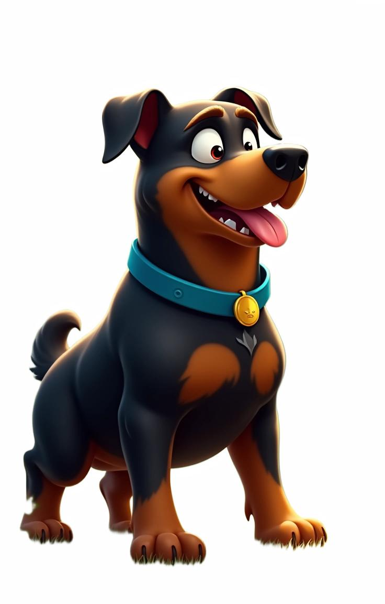

# Introduction


This repository contains unofficial implementation of the paper [Large-Scale Text-to-Image Model with Inpainting is a Zero-Shot Subject-Driven Image Generator](https://arxiv.org/abs/2411.15466).

This model is based on [alimama-creative/FLUX-Controlnet-Inpainting](https://github.com/alimama-creative/FLUX-Controlnet-Inpainting), mainly achieve consistent ID of subject in theme images over diverse scenes.

⭐If you think this project is helpful, please click on Star to support us!

---

# How to run

```
git clone https://github.com/ykj467422034/DiptychPrompting-unofficialE.git
cd DiptychPrompting-unofficial
pip install -r requirements.txt
python infer.py
```

# My Experimental Code Demos

| **原图**                          | **Gseg(Iref)**                                                     | **Idiptych**                                                     | **Tdiptych**                                                                                                                                                                                                                                                                                                                                                                                                                                                                                                   | **I^diptych**                  |
| --------------------------------------- | ------------------------------------------------------------------------ | ---------------------------------------------------------------------- | -------------------------------------------------------------------------------------------------------------------------------------------------------------------------------------------------------------------------------------------------------------------------------------------------------------------------------------------------------------------------------------------------------------------------------------------------------------------------------------------------------------------- | ------------------------------------ |
|  |  |  | A digital illustration of Pikachu, a yellow, mouse-like Pokémon with large ears, red cheeks, and a lightning bolt tail, standing upright with a cheerful expression and open mouth.                                                                                                                                                                                                                                                                                                                                 |  |
|   |         |       | A diptych with two side-by-side images of the same dog. On the left, A digital illustration of a happy, anthropomorphic black and tan dog with a blue collar, tongue out, and expressive eyes, standing on green grass.. On the right, replicate this dog but as Jumping in the air, holding a frisbee, with a beach by the sea in the background.                                                                                                                                                                   |        |
|  |        |      | A diptych with two side-by-side images of the same Wolf. On the left, a digital illustration of a realistic, detailed gray wolf with piercing blue eyes, sitting on its haunches. On the right, replicate this Wolf but as Walking on the sunny beach.                                                                                                                                                                                                                                                               |       |
|   |         |       | A diptych with two side-by-side images of the same man. On the left, tattoo, tattoo on arm, jewelry, earrings, sfw, tattoo on chest, muscular, muscular male, short hair, male focus, necklace, solo, 1boys, arm tattoo, blue eyes, tattoo on shoulder, looking at viewer. On the right, replicate this man but as Facing the camera, Kneeling on the knee, holding a rose in hand, with a park in the background.                                                                                                   |        |
|   |         |       | A diptych with two side-by-side images of the same girl. On the left, dress, brown hair, jewelry, original, long_hair, backless dress, 1girl, earrings, back, from side, ponytail, looking back, sfw, dress_lift, dress pull, ass, female solo, backless, white dress.. On the right, replicate this girl but as Full body, with the left hand lifting the hair, smiling from a frontal angle, wearing a wide brimmed hat on the head, with a background of a commercial street, neon lights, and the moon at night. |        |

# Env

40G VRAM

Resolution of ( 2*736, 1152 ) by 30 Steps of 50s

# Acknowledgements

This is developed by KUNLUN Skywork AIStory team, all copyright reserved.

Thanks to [Large-Scale Text-to-Image Model with Inpainting is a Zero-Shot Subject-Driven Image Generator](https://arxiv.org/abs/2411.15466).

Thanks to [alimama-creative/FLUX-Controlnet-Inpainting](https://github.com/alimama-creative/FLUX-Controlnet-Inpainting).

Thanks to [suchot](https://github.com/suchot) offer the original images.
